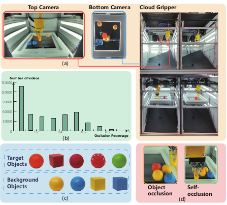

# OccluManip

### Paper titled "Video Transformers under Occlusion: How Physics and Background Attributes Impact Large Models for Robotic Manipulation" submitted to 2024 IEEE International Conference on Robotics and Automation (ICRA 2024)

### The work is currently under review. A sample of the dataset is provided in OccluManip_Samples.zip 

### The full dataset and code will be released after the paper acceptance. Thanks!

